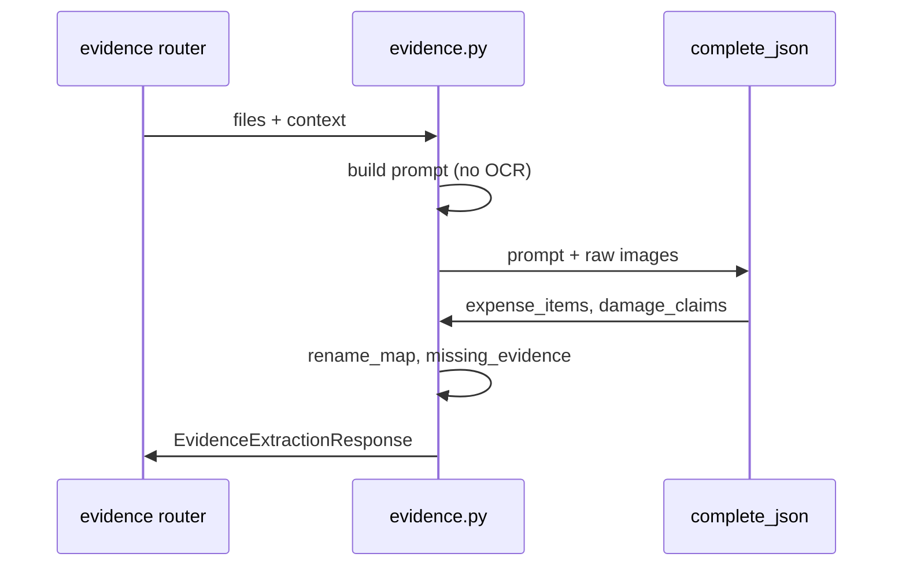
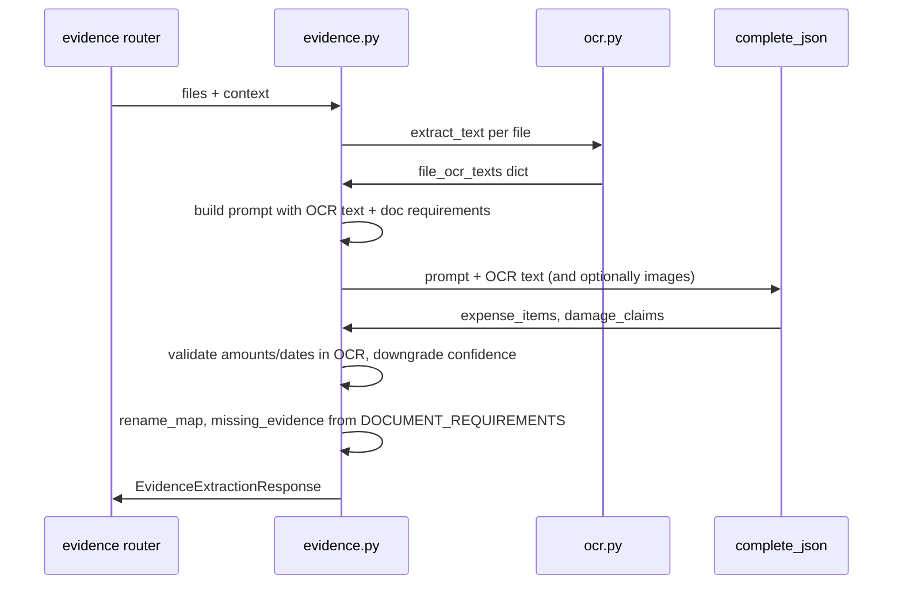

# OCR-First Evidence Extraction + Document Requirements

## Current flow (to replace)

Today the vision model both "reads" and structures in one pass; amounts/dates are not anchored to OCR.

## Target flow

---

## 1. Dependencies and OCR service

**1.1 Add to [backend/requirements.txt**](backend/requirements.txt)  

- `pytesseract==0.3.13`  
- `pymupdf==1.24.10`

**1.2 New file: [backend/app/services/ocr.py**](backend/app/services/ocr.py)  

- **Images (JPEG, PNG, WebP, GIF):** open bytes with `PIL.Image.open(BytesIO(bytes))`, convert to RGB if needed, run `pytesseract.image_to_string(img, lang="eng")`, return stripped text.  
- **PDF:** open stream with `pymupdf.open(stream=pdf_bytes, filetype="pdf")`, for each page get `page.get_pixmap(dpi=150, alpha=False)`, convert to PNG bytes via `pix.pil_tobytes(format="PNG")`, run same image OCR on each, concatenate with `[Page N]\n...`.  
- **API:** single function `extract_text(filename: str, file_bytes: bytes, mime_type: str) -> str`. Return `""` on unsupported type or failure; log and do not raise so the rest of the pipeline can still run (LLM can fall back to vision).  
- **Note:** Tesseract must be installed on the host (e.g. `brew install tesseract` on macOS).

---

## 2. Document requirements (single source of truth)

**2.1 New file: [backend/app/document_requirements.py**](backend/app/document_requirements.py)  

Define a list of requirement objects (Pydantic or typed dicts) with:

- **id** (e.g. `lease`, `insurance`, `payroll`, `utility`, `damage_photos`, `bank_statements`, `tax_returns`, `business_license`)  
- **name** (display string, e.g. "Lease agreement or rent statement")  
- **required_fields** (list of field names to extract: e.g. lessor name, monthly rent, period for lease; vendor, date, amount, category for receipts)  
- **date_range** (e.g. "Last 3 months", "Current policy period", "Most recent tax year")  
- **forms** (e.g. "None", "IRS 1040/1120", "SBA Form 5" if applicable)  
- **actionable_outcomes** (short string: how this doc is used — forbearance letter, SBA verification, FEMA claim, etc.)

Populate one entry per current `EXPECTED_EVIDENCE_CATEGORIES` item so coverage is the same. Use this list as the only source for:

- Building **missing_evidence** (iterate requirements; if no matching evidence category/filename, add `MissingEvidence(item=name, reason=actionable_outcomes)` or a short "why" derived from it).  
- Injected **prompt text** so the LLM knows document types, required fields, date ranges, and outcomes.

---

## 3. Stricter evidence schema and OCR anchoring

**3.1 [backend/app/models/evidence.py**](backend/app/models/evidence.py)  

- **ExpenseItem:** Add optional `document_type: str = ""` (e.g. `receipt`, `utility_bill`, `lease`, `payroll`, `bank_statement`, `tax`, `other`) so extraction can tag document kind.  
- **DamageClaim:** Add **required** `source_file: str` so each claim is tied to a filename. Fix [evidence.py](backend/app/services/evidence.py) rename logic that currently uses `fn in (d.source_text or "")`; use `d.source_file == fn` once `source_file` exists.  
- **MissingEvidence:** No schema change; keep `item` and `reason`. Populate `reason` from document requirements (e.g. actionable_outcomes).

**3.2 OCR anchoring in [backend/app/services/evidence.py**](backend/app/services/evidence.py)  
After the LLM returns:  

- For each **ExpenseItem**, get the OCR text for `source_file` from the `file_ocr_texts` dict.  
- Check that the **amount** (as string, e.g. `"150.00"` or `"150"`) appears in that OCR text (normalize: strip `$`, commas).  
- Check that the **date** (or a normalized substring like YYYY-MM or a digit sequence) appears in the OCR text.  
- If amount or date is **not** found in OCR: set `confidence = ConfidenceLevel.NEEDS_REVIEW` and optionally set `source_text` to a note like "Amount/date not found in OCR; needs review."  
- Do not drop the item; only downgrade confidence so the packet builder and UI can still show it with a review flag.

---

## 4. Evidence flow changes (OCR first, then LLM)

**4.1 [backend/app/services/evidence.py**](backend/app/services/evidence.py)  

- **Step 1 — OCR:** For each `(filename, file_bytes, mime_type)` call `ocr.extract_text(filename, file_bytes, mime_type)` and build `file_ocr_texts: dict[str, str]` (filename -> full OCR text).  
- **Step 2 — Prompt:** Extend `_build_extraction_prompt` to accept `file_ocr_texts: dict[str, str]` and the document requirements. Include in the prompt:  
  - A short "DOCUMENT REQUIREMENTS" block (from [document_requirements.py](backend/app/document_requirements.py)): for each requirement, list name, required_fields, date_range, forms, actionable_outcomes.  
  - "The following OCR text is the source of truth for amounts and dates. Do not invent values."  
  - For each file: `--- FILE: <filename> ---\n<ocr_text>\n`  
  - Instruction: "For each expense, set source_text to an exact substring of the OCR text above. Set source_file to the filename. If amount or date is not in the OCR text, set confidence to needs_review."  
  - For damage: "For damage claims set source_file to the filename of the photo."
- **Step 3 — LLM call:** Keep calling `complete_json` with the same `_RawExtractionResult` schema (including new ExpenseItem.document_type and DamageClaim.source_file). You may pass **text-only** (prompt + OCR) or **text + images**; if images are passed, state in the prompt that amounts/dates must still come from the OCR text.  
- **Step 4 — Post-validate:** Run the OCR-anching logic above on each ExpenseItem.  
- **Step 5 — Missing evidence:** Replace the hardcoded `EXPECTED_EVIDENCE_CATEGORIES` and `category_mapping` in `_detect_missing_evidence` with a loop over the document requirements list: for each requirement, decide "found" if any expense has matching `document_type`/category or any filename matches (e.g. keywords from requirement id/name). If not found, append `MissingEvidence(item=req.name, reason=req.actionable_outcomes)`.  
- **Step 6 — Rename map:** In `_generate_rename_map`, for damage use `d.source_file == fn` instead of `fn in (d.source_text or "")`.

**4.2 Internal schema**  

- Update `_RawExtractionResult` (and thus the JSON schema sent to the LLM) so that **ExpenseItem** includes `document_type` and **DamageClaim** includes `source_file`. The API response type `EvidenceExtractionResponse` already exposes these models; no change needed there.

---

## 5. File-level checklist

| Task                                           | File(s)                                                                                                                                |
| ---------------------------------------------- | -------------------------------------------------------------------------------------------------------------------------------------- |
| Add pytesseract, pymupdf                       | [backend/requirements.txt](backend/requirements.txt)                                                                                   |
| Implement OCR for images + PDF                 | New [backend/app/services/ocr.py](backend/app/services/ocr.py)                                                                         |
| Document requirements spec                     | New [backend/app/document_requirements.py](backend/app/document_requirements.py)                                                       |
| Add document_type, source_file; OCR anchoring  | [backend/app/models/evidence.py](backend/app/models/evidence.py), [backend/app/services/evidence.py](backend/app/services/evidence.py) |
| Wire prompt + missing_evidence to requirements | [backend/app/services/evidence.py](backend/app/services/evidence.py)                                                                   |
| Fix rename map for damage by source_file       | [backend/app/services/evidence.py](backend/app/services/evidence.py)                                                                   |

---

## 6. Optional: Frontend / API contract

- **EvidenceExtractionResponse** is unchanged in shape; new fields are additive (`document_type` on ExpenseItem, `source_file` on DamageClaim). Existing frontends remain compatible.  
- If the frontend shows "missing evidence" or a checklist, it can optionally display the new `reason` (actionable outcomes) from the document requirements; no API change required.

---

## 7. Testing and environment

- Ensure Tesseract is installed where the backend runs (CI and local). Document in README or POSTMAN: "For evidence extraction with OCR, install Tesseract (e.g. `brew install tesseract`)."  
- If Tesseract is missing, `extract_text` can catch the failure and return `""` so the pipeline still runs (LLM-only path).

